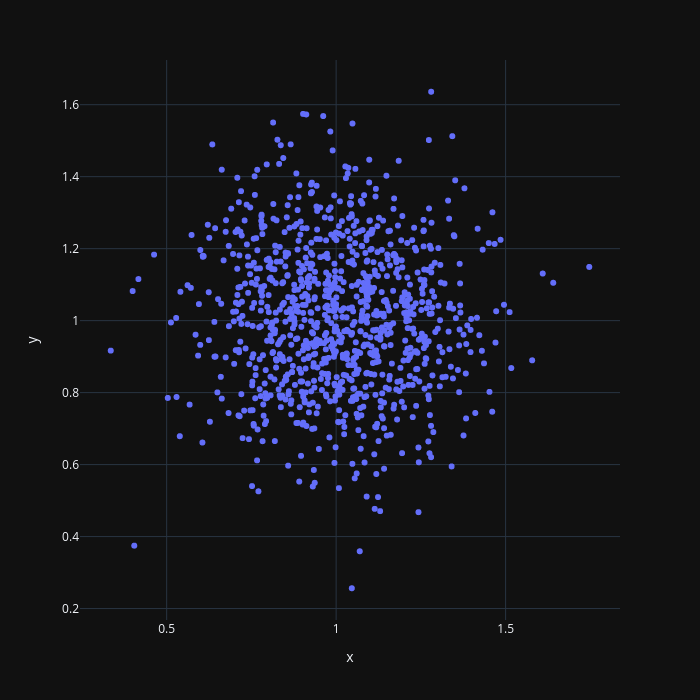

# Marp Testing
Marshall Bruner :rocket:

---

## Description
Hello, this is me testing `marp`, a powerpoint alternative for programmers.

---

## Add Code and Output


``` python 
size = 1000
cluster_1 = pd.DataFrame(dict(
    x=np.random.normal(1, 0.2, size),
    y=np.random.normal(1, 0.2, size))
    )
fig = px.scatter(cluster_1, 
    x='x', 
    y='y', 
    marginal_x='histogram', 
    marginal_y='histogram', 
    template='plotly_dark')
fig.update_layout(
    width=700, 
    height=700)
```
---

# Math
You can write math inline ($\vec{B}=\mu \vec{H}$) using \$, or use \$\$ for multi-line math. An example is the discrete-time equation for the beat signal received by an FMCW radar.
$$
b[l,m] = 
    a \underbrace{
        \exp \left[ j 2\pi \left( \underbrace{
            \frac{2f_c v}{c}}_{\substack{\text{Doppler} \\ \text{shift}}} + 
            \underbrace{\frac{2B_{RF} R}{t_{ramp}c}}_{f_{beat}} 
            \right) lT_s \right]}_{\text{Fast time}} 
            \underbrace{\exp \left[ j 2\pi \frac{2f_cv}{c} 
    mT_{PRI} \right]}_{\text{Slow time}}
$$